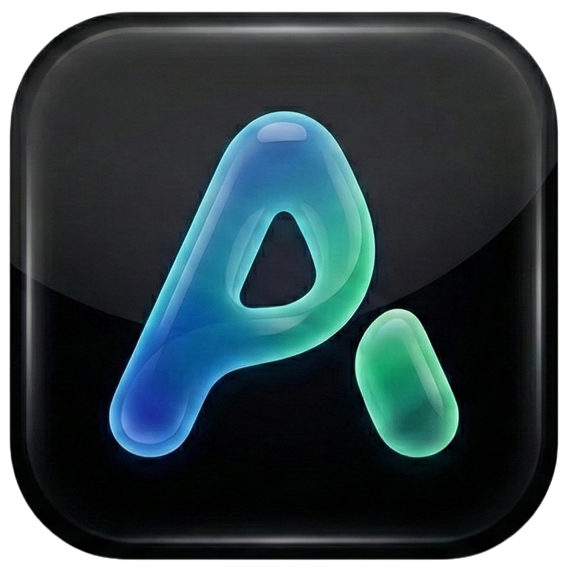

<p align="center">
  
</p>

<h1 align="center">Anti-Power Patch</h1>

<p align="center">
  <a href="https://github.com/daoif/anti-power/releases">
    
  </a>
  <a href="https://codeium.com/antigravity">
    
  </a>
  <a href="LICENSE">
    
  </a>
</p>

<p align="center">
  <a href="README.md">中文</a> | English
</p>

> 🚀 Enhancement patch for **Antigravity AI IDE**, improving the Sidebar and Manager window conversation experience!

<p align="center">
  💬 <a href="https://qm.qq.com/q/AHUKoyLVKg">QQ Group: 993975349</a>
</p>

---

## Introduction

Anti-Power enhances the Antigravity Sidebar and Manager window by applying patches that provide features such as Mermaid rendering, Math formula rendering, one-click copy, table color fixes, and font size/width adjustments. We hope to continuously improve the experience through community collaboration. Issues and Pull Requests are welcome.

---

## Features

| Feature | Description |
|---------|-------------|
| **Mermaid Rendering** | Automatically renders flowcharts, sequence diagrams, class diagrams, etc., supporting dark themes |
| **Math Formula Rendering** | Supports `$...$` inline formulas and `$$...$$` block formulas |
| **One-Click Copy** | Sidebar and Manager provide a Copy button that automatically converts to Markdown |
| **Table Color Fix** | Fixes invisible table text issues in dark themes |
| **Manager Layout Adjustment** | Supports conversation width and font size adjustment |
| **Floating Copy Button** | Top-right hover button + bottom-right persistent button for easy copying |

### Copy Features

- Code blocks automatically include language identifiers, e.g., \`\`\`python
- Tables are automatically converted to Markdown table format
- Smartly ignores AI intermediate thinking processes, copying only the final result
- Formulas and Mermaid diagrams are automatically restored to source code

### Patcher Features

- **Multi-language**: Support for English and Chinese interfaces
- **Themes**: Support for Light and Dark modes
- **Path Detection**: Auto-detect IDE directory for a hassle-free installation
- **Conversation Cleanup**: Clean conversation caches (macOS/Linux)

---

## 📸 Demo

For screenshots, see [screenshots.md](docs/reference/screenshots.md).

---

## 📥 Installation

### Windows (Recommended)

1. Go to the Releases page and download `anti-power-windows.exe`.
2. Double-click to run; no installation required.
3. The program automatically detects the Antigravity installation path.
4. Select the desired features and click "Install Patch".
5. Restart Antigravity or reopen the Manager window to see the effects.

For manual installation, download the patch zip file from Releases (e.g., `anti-power-patches.zip`) and refer to [manual-install.md](patcher/patches/manual-install.md).

### macOS (Recommended)

1. Download `anti-power-macos-universal.dmg` (Intel/Apple Silicon)
2. Open the DMG and drag `Anti-Power.app` to Applications
3. Run it and install the patch as prompted

#### Temporary fix for macOS "is damaged"

If macOS shows "is damaged" or "can't be opened" on first launch, try this temporary workaround first (we'll consider a better solution later):

```bash
# Remove the quarantine attribute (adjust the path if needed)
xattr -cr /Applications/Anti-Power.app
```

Or: right-click the app -> choose "Open" (instead of double-click).

### Linux (Recommended)

1. Download `anti-power-linux.AppImage`
2. Make it executable and run it, then install the patch as prompted

```bash
chmod +x ./anti-power-linux.AppImage
./anti-power-linux.AppImage
```

### macOS & Linux (Script, Optional)

If the installer app isn't usable, or you prefer CLI/batch installs, download `anti-power-patches.zip` from Releases, unzip it, and run `anti-power.sh` inside.

> ⚠️ **Note**: Requires admin privileges; run in a terminal.

```bash
# Run inside the extracted patches folder
chmod +x ./anti-power.sh
sudo ./anti-power.sh
```

For manual installation, please refer to [manual-install.md](patcher/patches/manual-install.md).

---

## Notes

- **Update Overwrite**: Official Antigravity updates may overwrite the patch, requiring reinstallation.
- **Version Compatibility**: Please verify that your Antigravity version matches the supported version before use.
- **Backup Habits**: Create a backup of original files before replacement to facilitate rollback.
- **Known Issues**: See [known-issues.md](docs/reference/known-issues.md).

---

## Documentation

- Project Structure & Classification: see [docs/README.md](docs/README.md)
- Screenshots: [screenshots.md](docs/reference/screenshots.md)
- Known Issues: [known-issues.md](docs/reference/known-issues.md)
- Developer Guide: [developer-guide_EN.md](docs/guides/developer-guide_EN.md) | [中文](docs/guides/developer-guide.md)
- Release Guide: [release-guide.md](docs/guides/release-guide.md)
- Index: [README.md](docs/README.md)

---

## 📋 Version Info

Current Version: **v3.0.1** | Supports Antigravity: **v1.16.5**

For full changelog, see [CHANGELOG_EN.md](CHANGELOG_EN.md).

---

## 📚 References

The table color fix solution in this project references the following tutorials:

- 📺 **Video Tutorial**: [Antigravity Perfect Dark Theme Modification Guide](https://www.bilibili.com/video/BV1vTrgBXEA1)
- 📖 **Article**: [The Ultimate Solution for Invisible Table Text](https://dpit.lib00.com/zh/content/1192/antigravity-perfect-dark-theme-modification-guide-fix-invisible-table-text)

---

## 🤝 Contribution

Issues and Pull Requests are welcome.

---

## 🙏 Acknowledgments

Thanks to the following contributors for their support:

- [@mikessslxxx](https://github.com/mikessslxxx) - Math formula rendering, Manager enhancements
- [@syanle](https://github.com/syanle) - Linux support
- [@Sophomoresty](https://github.com/Sophomoresty) - Copy function optimization, developer documentation

---

## ⚖️ License

MIT License

---

<p align="center">
  💡 If this project helps you, please Star ⭐
</p>
